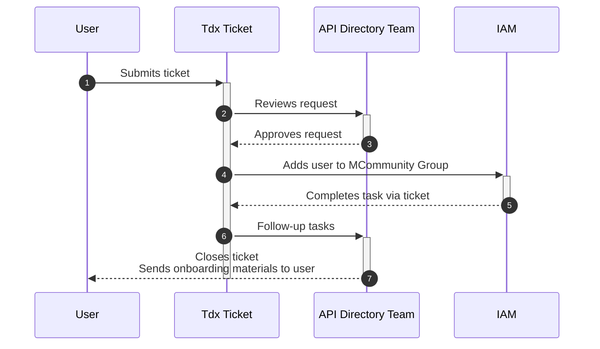
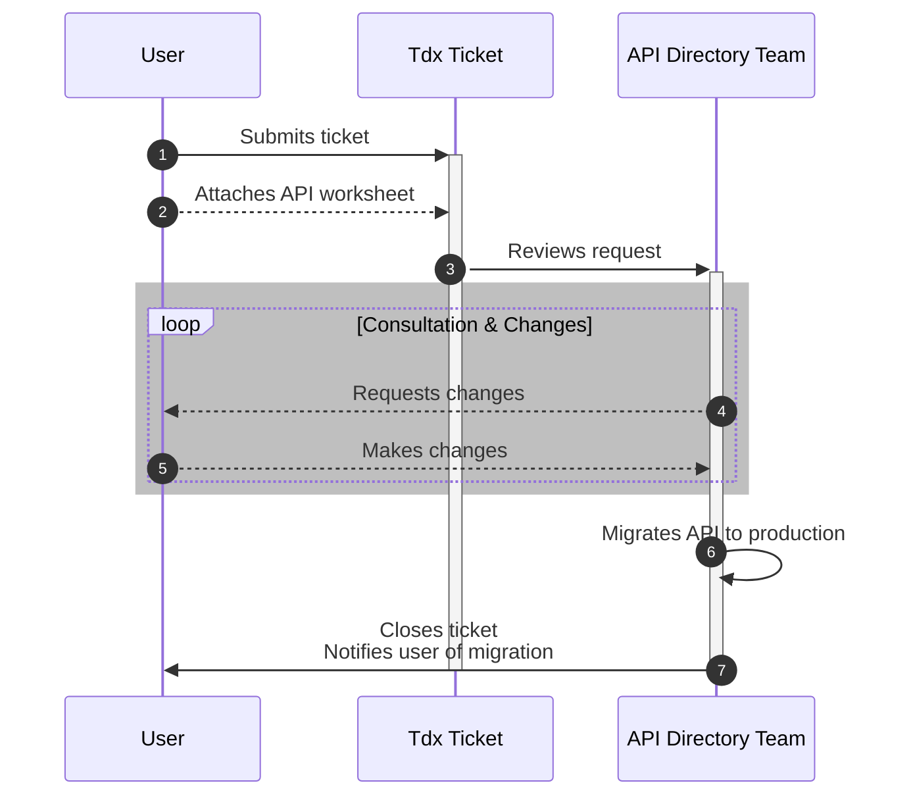

# User Story: API Developer Experience

This user journey follows a prospective API developer as they attempt to publish an API in the API Directory.

## API Developer Onboarding

The user gains access to Apigee by submitting a Tdx ticket and being added to the apidir-developers MCommunity group.

## API Development

Once the developer is able to access Apigee, they are expected to navigate the platform and independently complete all development work in the nonprod environments with little consultation from the API team.

## API Migration Flow

At some point, work has progressed to the point where the developer would like to migrate their changes to production. They will need to submit a Tdx ticket to request that their API be published.

