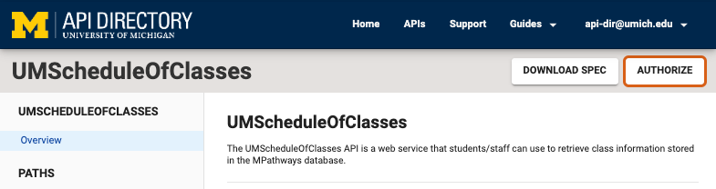
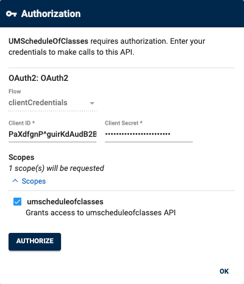
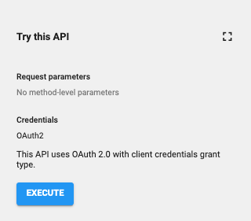
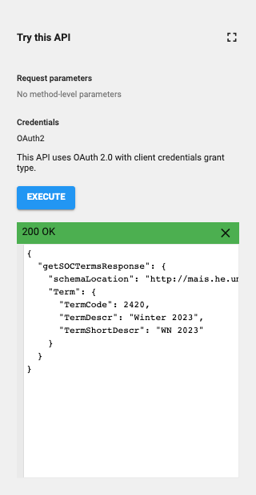
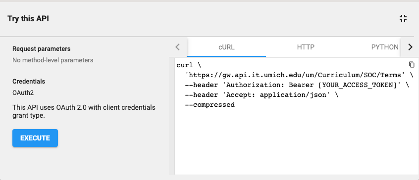

# Consuming an API

## Overview

This article will demonstrate how to consume an API through the API Directory's Integrated Portal. It will also link to external resources to sample code and Postman configurations to help users test and consume APIs programmatically.

## Consuming an API from the API Directory Portal

To consume an API from the API Directory integrated portal, you will need to follow the steps in our [Getting Started][get-started] guide to login, create an app, and obtain credentials (API key/secret) for your app. Additionally you will want to ensure your app has subscribed to the API that you will be consuming.

Once you have configured your app and obtained its credentials, you will be able to consume any APIs you have subscribed to through the API Directory by following these steps:

1. Navigate to the API you would like to consume via the [APIs][apis-page] page.
2. Use the left sidebar to navigate to one of the PATHS offered by the API.
   <figure>
   
3. Click on the **Authorize** button at the top of the page:
 <figure>
  
</figure>

4. Enter your Client ID (API Key) and Client Secret (API Secret) into the Authorization modal and click **Authorize** to authenticate your app's credentials.
   <figure>
    
   </figure>

5. Once you have authenticated your app, you will be able to use the **Try this API** feature located on the right sidebar. Provide any desired parameters and click the **Execute** button to call the API.
   <figure>
   
   </figure>

6. The response to your API call will be displayed at the bottom of the **Try this API** tool:
   <figure>
   
   </figure>

  
<i class="fa-solid fa-mobile" aria-hidden="true" role="img"></i>On mobile?

  If you are on a mobile device, the <strong>Try this API</strong> section will be located at the bottom of your page.

## Try This API Code Snippets

The **Try This API** tool will also generate sample code snippets of your request in various languages. Click the expand icon (<i class="fa-solid fa-expand" role="img" aria-label="Try this API expand icon" style="background: #eee; padding: 3px; border-radius: 2px; border: 1px solid #ddd; margin: 0 .125em;"></i>) near the top right of the tool to view code samples in cURL, HTTP, Python, Node.js, JavaScript, PHP, and Java.

## Postman Collections

The API Directory Team has assembled a repository of [Postman collections][postman-repo] for each API that list listed in the Directory. See the associated [How To][postman-howto] guide for more information about Postman and the using the provided collections.

## API Directory Code Examples

Please consult the samples provided in the [API Directory code examples][apidir-code-examples-repo] GitHub repo. The repo offers sample code for consuming APIs using Bash, JavaScript, and Python.

[apidir-code-examples-repo]: https://github.com/apidir/http-client-code-examples
[postman-repo]: https://drive.google.com/drive/folders/1OdXufmwJJ_Qy-uSJImlmZImCkN-RqBCE
[postman-howto]: https://docs.google.com/document/d/1o-FROaajYIA_A-Nz5a6N2fgQZQgS0T-P/edit
[get-started]: https://dir.api.it.umich.edu/get-started
[managing-apps]: https://dir.api.it.umich.edu/guides/managing-apps
[apis-page]: https://dir.api.it.umich.edu/apis
